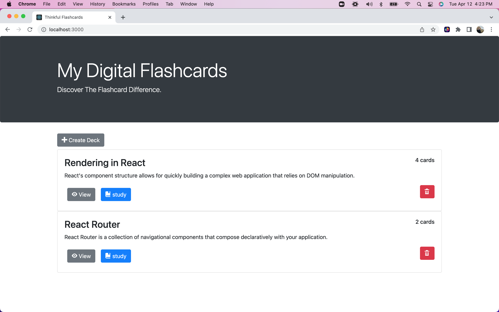
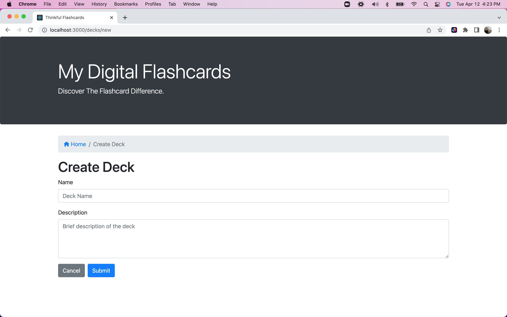
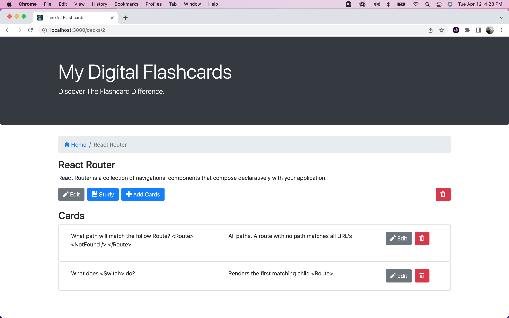
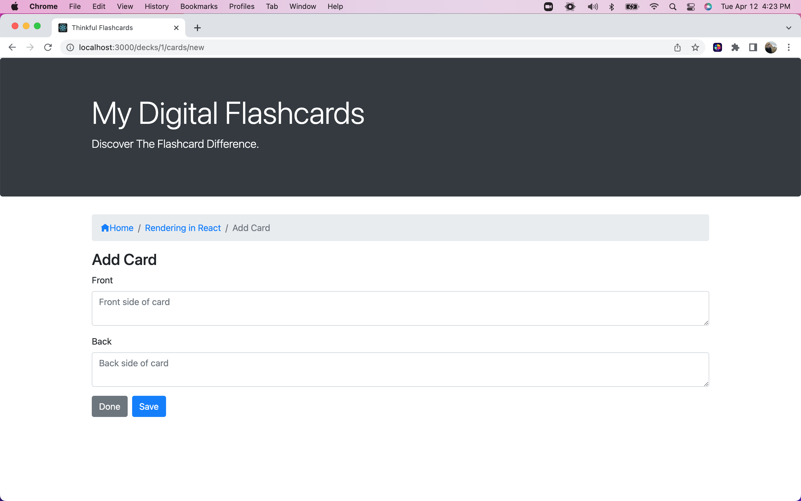

# My Digital Flashcards

A FrontEnd web application to create decks of flashcards, which can store these created decks into an api, and upon request, retrieve them to be studied.

## Features
1. Allows for creation of individual decks and to name and categorize subjects
2. Allows for the creation of several cards within each individual deck, which includes a front and back side
3. Once decks and cards are created with a minimum of 3 cards in a deck, allows user to implement a study view 
4. Users can delete both decks and cards

## Tech
Rendering of a full-stack study tool application using React, React hooks and stateful components. Built website routing using React Router and made Fetch API calls using RESTful design principles.

Languages, frameworks, and packages used include:

* HTML5
* CSS3
* Bootstrap
* JavaScript ES6
* React (with hooks)

## Installation
Install the dependencies and devDependencies and start the server.

cd My-Digital-Flashcards
npm i
npm start 

**For windows users:**

npm run start:react
npm run start:server
The start command will start two servers concurrently:

An API server, powered by json-server, running on http://localhost:5000 A React application running on http://localhost:3000

## Overview Presentation

_**The code provided shows the FrontEnd design only.  Backend server has not been created.  The Data -db.json file is to mimic what the server would provide.  However, if there was a working server, the final product would work similar to this [Flashcards Example Layout](http://project-flashcards-example.herokuapp.com/)**_

-see below for a preview of final product:

***

When first arriving on the Web application, the user will s

